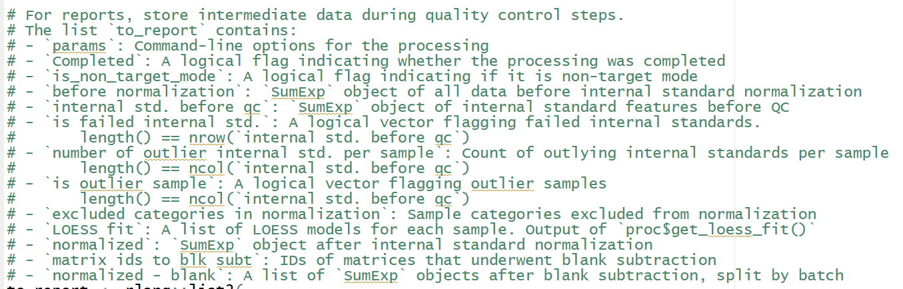
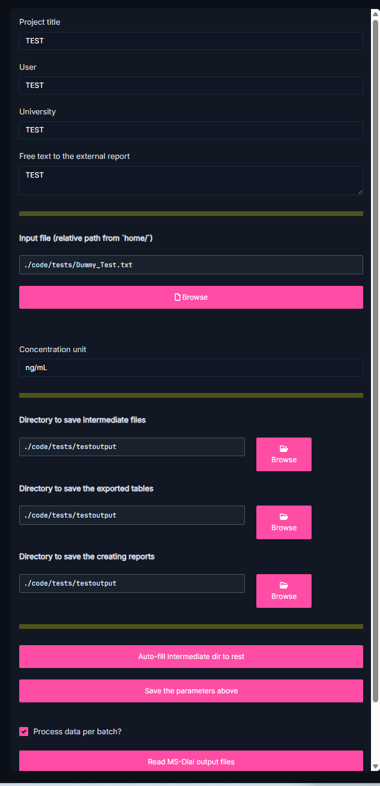
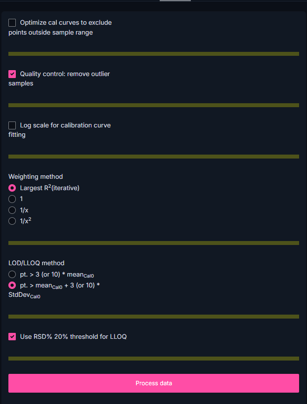
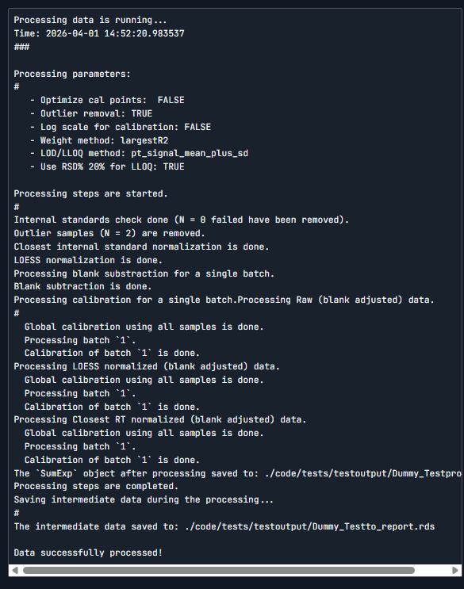
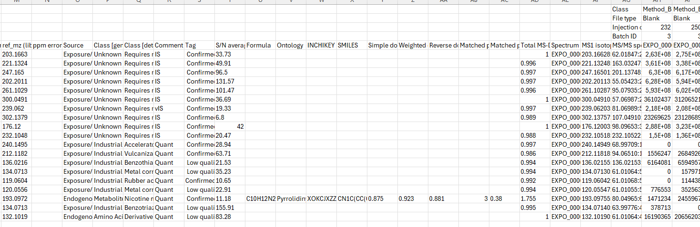
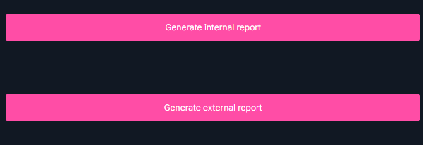
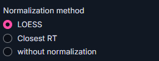
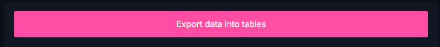

I assume many objects are generated along with the html. the idea is to extract these object and used for shiny interface visualization. Currently what is extracted by Mun-Gwan is



## Page 0 basic input

The information included in the whole page



## Page 1 processing

### left side



The ***normlization method*** option button is not there. but all three methods is run in the background.

+--------------------------------+-------------------------------------------------------------------+
| To show in the shiny interface | what to extract                                                   |
+================================+===================================================================+
| nothing                        | The corresponding input, already done by Mun-Gwan                 |
|                                |                                                                   |
|                                | The normalization method option needs to be extracted as an value |
+--------------------------------+-------------------------------------------------------------------+

### right side



## Page 2 Data summary

### top left

### bottom left

+-----------------------------------+--------------------------------+
| To show in the shiny interface    | what to extract                |
+===================================+================================+
| Table in section 2.1.1            | as a dataframe                 |
+-----------------------------------+--------------------------------+
| Table in section 2.1.2.2          | as a dataframe                 |
+-----------------------------------+--------------------------------+
| Table in section 2.1.3            | as a dataframe                 |
+-----------------------------------+--------------------------------+
| Table in section 2.2              | as a dataframe                 |
+-----------------------------------+--------------------------------+

### top right

+--------------------------------+----------------------------------------------------------------------------+
| To show in the shiny interface | what to extract                                                            |
+================================+============================================================================+
| 2 figures in section 2.2       | as two ggplotly (Note! Stefano want this to be plotly) object respectively |
+--------------------------------+----------------------------------------------------------------------------+

### bottom right

+--------------------------------+------------------------------------+
| To show in the shiny interface | what to extract                    |
+================================+====================================+
| 2 figures in section 2.3       | as two ggplot objects respectively |
+--------------------------------+------------------------------------+

## Page 3 Quality control

### top left

+-----------------------------------+--------------------------------+
| To show in the shiny interface    | what to extract                |
+===================================+================================+
| table in section 3.1              | as a dataframe                 |
+-----------------------------------+--------------------------------+

**--\>this table 3.1 will be made selective,** where user can click rows to have information related to that row

```{r}
#| eval: false

library(shiny)
library(DT)

ui <- fluidPage(
  h3("Click a row in the table"),
  DTOutput("mytable"),
  verbatimTextOutput("selected_row")
)

server <- function(input, output, session) {
  
  df <- data.frame(
    Name = c("Alice", "Bob", "Charlie"),
    Score = c(90, 75, 82)
  )
  
  output$mytable <- renderDT({
    datatable(
      df,
      selection = "single"   # or "multiple"
    )
  })
  
  output$selected_row <- renderPrint({
    selected <- input$mytable_rows_selected
    if (length(selected)) {
      df[selected, ]
    } else {
      "Click on a row above."
    }
  })
}

shinyApp(ui, server)
```

+-----------------------------------------------------------+-------------------------------------------------------------------------------------------------+
| To show in the shiny interface                            | what to extract                                                                                 |
+===========================================================+=================================================================================================+
| Text in 3.1.1                                             | A logical value of TRUE or FALSE for failed internal standard (deciding what text to print out) |
|                                                           |                                                                                                 |
| "More than 10% samples have zero values"                  |                                                                                                 |
|                                                           |                                                                                                 |
| OR, "There is no failed internal standard"                |                                                                                                 |
|                                                           |                                                                                                 |
| This depends on whether there is failed internal standard |                                                                                                 |
+-----------------------------------------------------------+-------------------------------------------------------------------------------------------------+

--\> **the binary variable will decide the table 3.1 will be updated or not (e.g., the failed internal standards are colored)**

+------------------------------------------------------------------------+----------------------------------------------------------------------------------------------------------------------------+
| To show in the shiny interface                                         | what to extract                                                                                                            |
+========================================================================+============================================================================================================================+
| Text in 3.1.2                                                          | A logical value of TRUE or FALSE fro whether outlier removal is selected/checked by user (deciding what text to print out) |
|                                                                        |                                                                                                                            |
| "The following samples were indentified as outliers and excluded"      |                                                                                                                            |
|                                                                        |                                                                                                                            |
| Or show "The following samples has not performed ourlier removal"      |                                                                                                                            |
|                                                                        |                                                                                                                            |
| This depends on whether outlier removal is previously selected/checked |                                                                                                                            |
+------------------------------------------------------------------------+----------------------------------------------------------------------------------------------------------------------------+
| Table in 3.1.2 (always show)                                           | as a dataframe                                                                                                             |
+------------------------------------------------------------------------+----------------------------------------------------------------------------------------------------------------------------+
|                                                                        |                                                                                                                            |
+------------------------------------------------------------------------+----------------------------------------------------------------------------------------------------------------------------+

### right

### 

+-----------------------------------------------------------------------------------------------------------------------------------------------------------------------------------------+----------------------------------------------------------------------------------------------------------------------------------+
| To show in the shiny interface                                                                                                                                                          | what to extract                                                                                                                  |
+=========================================================================================================================================================================================+==================================================================================================================================+
| one table combining from 3.1.4.1 and 3.1.4.2 . After users' selection when clicking the table at top left, this table will be updated based on the previously selected IS in table 3.1. | a dataframe of table 3.1.4.1                                                                                                     |
|                                                                                                                                                                                         |                                                                                                                                  |
| In this table, it is tranformed to a new table like                                                                                                                                     | a dataframe of table 3.1.4.2                                                                                                     |
|                                                                                                                                                                                         |                                                                                                                                  |
| | value         | number |                                                                                                                                                              | (all information from the table is extracted, so that I could generate the news table based on the selected IS when user clicks) |
| |---------------|--------|                                                                                                                                                              |                                                                                                                                  |
| | NIST_spk_10ng | ....   |                                                                                                                                                              |                                                                                                                                  |
| | QCpool        |        |                                                                                                                                                              |                                                                                                                                  |
| | Method_blank  |        |                                                                                                                                                              |                                                                                                                                  |
| | Sample        |        |                                                                                                                                                              |                                                                                                                                  |
| | ...           |        |                                                                                                                                                              |                                                                                                                                  |
+-----------------------------------------------------------------------------------------------------------------------------------------------------------------------------------------+----------------------------------------------------------------------------------------------------------------------------------+

### top middle

+------------------------------------------------------------------+---------------------------------------------+
| To show in the shiny interface                                   | what to extract                             |
+==================================================================+=============================================+
| one Figure in 3.1.3.                                             | All ggplot objects of corresponding figures |
|                                                                  |                                             |
| Which one to show is based on the selection of rows in table 3.1 |                                             |
+------------------------------------------------------------------+---------------------------------------------+

### bottom middle

There is one selection button to be shown what to ***color by*** : by class, or batch id, or by which internal standard it is. this information is from the input data

+-----------------------------------------------------------------------------------+-----------------------------------------------------------------------------------------------------------------------------------------------------------------+
| To show in the shiny interface                                                    | what to extract                                                                                                                                                 |
+===================================================================================+=================================================================================================================================================================+
| the firstone vIS Figure as in 3.2.1.2/3.2.2.2,                                    | the corresponding all ggplot objects of vIS figures (by class, by batch id or by which internal standard), if there is "vIS" in the "Comment" in the input data |
|                                                                                   |                                                                                                                                                                 |
| Which one to show is based on:                                                    | or NULL, if there is NOT "vIS" in the "Comment" in the input data                                                                                               |
|                                                                                   |                                                                                                                                                                 |
| -   The ***color by*** option                                                     |                                                                                                                                                                 |
|                                                                                   |                                                                                                                                                                 |
| <!-- -->                                                                          |                                                                                                                                                                 |
|                                                                                   |                                                                                                                                                                 |
| -   The figure of Raw will be shown (fixed, 1 out of the 3 noemalization choices) |                                                                                                                                                                 |
|                                                                                   |                                                                                                                                                                 |
| or nothing if there is no VIS                                                     |                                                                                                                                                                 |
+-----------------------------------------------------------------------------------+-----------------------------------------------------------------------------------------------------------------------------------------------------------------+

+--------------------------------------------------------------------------------------------------------+------------------------------------------------------+
| To show in the shiny interface                                                                         | what to extract                                      |
+========================================================================================================+======================================================+
| one Figure as in 3.2.1.2/3.2.2.2                                                                       | the corresponding ggplot objects of all figures      |
|                                                                                                        |                                                      |
| Which one to show is based on:                                                                         | -   all figures orange-blue (color by class)         |
|                                                                                                        |                                                      |
| -   The ***color by*** option                                                                          | -   all figures red (color by batch id)              |
|                                                                                                        |                                                      |
| -   The figure of Raw and LOESS normalized will be shown (fixed, 2 out of the 3 noemalization choices) | -   all figures rainbow (color by internal standard) |
+--------------------------------------------------------------------------------------------------------+------------------------------------------------------+

+------------------------------------------+-------------------------------+
| To show in the shiny interface           | what to extract               |
+==========================================+===============================+
| one Figure in 3.2.3                      | A ggplot object of the figure |
+------------------------------------------+-------------------------------+



+-----------------------------------+--------------------------------+
| To show in the shiny interface    | what to extract                |
+===================================+================================+
| table in section 3.2.3            | as a dataframe                 |
+-----------------------------------+--------------------------------+

## Page 4 Quantification

### left

+--------------------------------+--------------------------------------+
| To show in the shiny interface | what to extract                      |
+================================+======================================+
| table 4.1                      | as a dataframe                       |
+--------------------------------+--------------------------------------+

+--------------------------------+--------------------------------------+
| To show in the shiny interface | what to extract                      |
+================================+======================================+
| table 4.2                      | as a dataframe                       |
+--------------------------------+--------------------------------------+

**--\>this table 4.2 will be made selective, where user can click rows**

### right

+------------------------------------------------------------------+-------------------------------------------------+
| To show in the shiny interface                                   | what to extract                                 |
+==================================================================+=================================================+
| one Figure as in 4.3                                             | the corresponding ggplot objects of all figures |
|                                                                  |                                                 |
| one Figure as in 4.4.2.1                                         | -   all figures from 4.3                        |
|                                                                  |                                                 |
| one Figure as in 5.1                                             | -   all figures from 4.3                        |
|                                                                  |                                                 |
| Which one to show is based on the selection of rows in table 4.2 | -   all figures from 5.1                        |
+------------------------------------------------------------------+-------------------------------------------------+

### 

+--------------------------------+--------------------------------------+
| To show in the shiny interface | what to extract                      |
+================================+======================================+
| the output of 4.5              | a dataframe object from 4.5          |
+--------------------------------+--------------------------------------+

## Page 5 Report export



one button of which normalization method to use



An radio button of whether do blank subtraction or not.



The output will always be two xlsx files.

-   One is named only based on ***normalization methods***

-   One is named based on both ***normalization methods*** and ***blank substraction*** option.

```{r}

```
